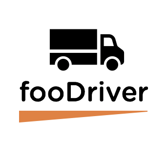

# fooDriver
fooDriver is a comprehensive digital pantry application for mobile grocery stores and food pantries serving the needs of people with low mobility or limited access to nutritious food. With fooDriver organizations administering mobile food pantries will have an overview of their fleet of mobile pantries, food items stored in the pantry, the drivers and the stops on the routes. Drivers or people working on the mobile pantry can keep track of inventory and restock items depending on the demand along the route. Organizations or individuals donating food items will be able to add to the inventory of the mobile pantries. With fooDriver we intend to streamline the operations of mobile grocery units and bring involved parties closer together in the process. Additionally, an administrative CLI is available for quick connect and data entry.

**React App URL:** http://foodriver.s3-website-us-west-2.amazonaws.com/

------

## Project Team
- [Sara Bahrini](https://github.com/sarabahrini)
- [Jen Carrigan](https://github.com/JenCarrigan)
- [George McCadden III](https://github.com/thethirdone-g)
- [Ryan Milton](https://github.com/Ryan-Milton)
- [Katherine Smith](https://github.com/ksmith10309)

------

## Table of Contents
- [Application Architecture](#Application-Architecture)
- [User Roles](#User-Roles)
- [Installation](#Installation)
- [Getting Started](#Getting-Started)
- [Dependencies](#Dependencies)
- [License](#License)

------

### Application Architecture
MongoDB, Node.js, Express, React

fooDriver is a digital pantry application that uses Javascript-related technologies and frameworks. It uses a MongoDB database to store users (admin, client, donator, driver), pantries, pantry items, item quantities, routes, stops, requests, and donations. It uses Node.js and Express server architecture to serve up the database. The database and server is deployed on Heroku.

The fooDriver web application is a React app created using create-react-app. On the fooDriver web application, you can sign up as either a client, a donator, or a driver. You can then login as either a client, a donator, or a driver. The web application is deployed on Amazon S3.

------

### User Roles
- **Client** can login and view each pantry, including the pantry items, the pantry route, and the stops along the route. A client can also fill out a form to make a request.

- **Donator** can login and view each pantry, including the pantry items, the pantry route, and the stops along the route. A donator can also fill out a form to make a donation.

- **Driver** can login and view his/her pantry, including the pantry items, the pantry route, and the stops along the route. A driver can also change the quantity of each item in his/her pantry.

------

### Installation
- Clone the app repository
- Once cloned make sure Node.js is installed
- Navigate to the directory where you cloned the app repository
- Run the command `npm i` to install all the modules dependencies
- You can now begin using the app

------

### Getting Started
- Navigate to the directory where you cloned the app repository
- Run the command `npm start` to compile
- Navigate to `http://localhost:3000/` to view the app in the browser

------

### Dependencies
babel-core, babel-jest, enzyme, enzyme-adapter-react-16, jest, jsonwebtoken, node-sass, querystring, react, react-addons-test-utils, react-cookies, react-dom, react-google-maps, react-jsonschema-form, react-router-dom, react-scripts, regenerator-runtime, superagent

------

### License
MIT License
